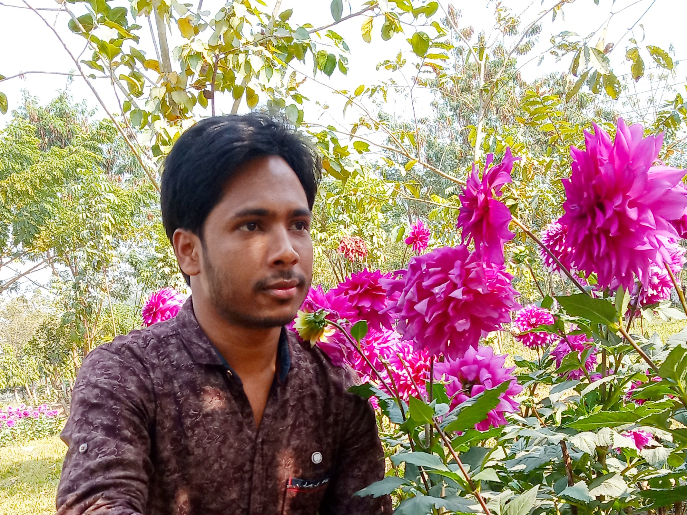

<!--  -->
  
 # 👋 Hello, I'm Faridul Islam
### A Full-Stack Web Developer

Living: Rangpur, Bangladesh.

## About Me :
I'm a very passionate  person, especially when it comes time to learn new technologies from young age. **I'm also passionate about making error-free websites with 100% client satisfaction.** I have been attracted by technology and how tools work, things growing etc. I have already learned HTML, CSS, JavaScript, TypeScript, React Js, Node Js, Express Js, Bootstrap, Tailwind, MongoDB/SQL for two years and more and continue learnig to improve my coding knowledge. I am spending so much time to improve my web development skills. Every day I want to learn something new, actaully I love to write code.

**Skills** : REACT/NodeJs/JS/HTML/CSS

- 🔭 I'm currently working on some React Js projects.

  

  

  

  

  

---
Thanks for going through my Portfolio. All rights reserved by Faridul Islam @2022

---
